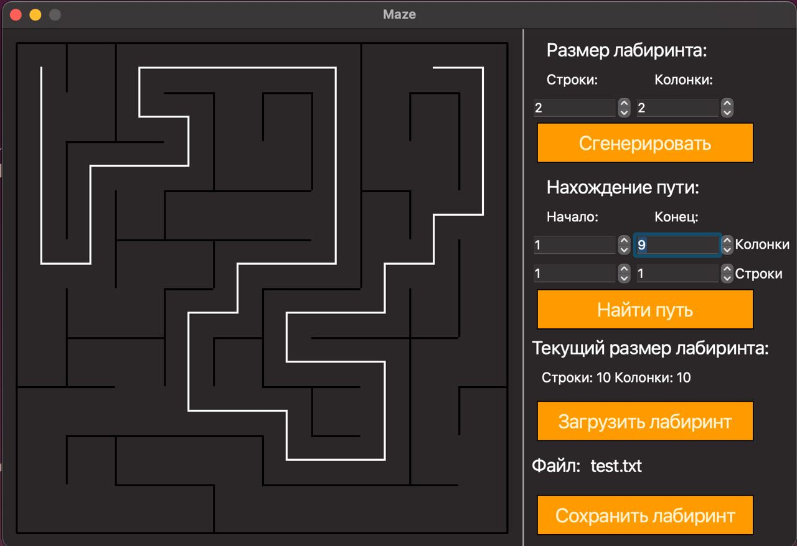

# Maze



Implementation of the Maze project.

The russian version of the task can be found in the repository.

## Contents

1. [Introduction](#introduction)
2. [Chapter I](#chapter-i) \
   2.1. [Information](#information)
3. [Chapter II](#chapter-ii) \
   3.1. [Part 1. Implementation of the Maze project](#part-1-implementation-of-the-maze-project) \
   3.2. [Part 2. Generation of a perfect maze](#part-2-generation-of-a-perfect-maze) \
   3.3. [Part 3. Solving the maze](#part-3-solving-the-maze)

## Introduction

In this project i'll learn about mazes, including the basic algorithms of their handling, such as: generation, rendering, solving.

## Chapter I

## Information

A maze with "thin walls" is a table of _n_ rows by _m_ columns size. There may be "walls" between the cells of a table. The table as a whole is also surrounded by "walls".

The following is an example of such a maze: \


The solution to a maze is the shortest path from a given starting point (table cell) to the ending one.

When traversing a maze, you can move to neighboring cells that are not separated by a "wall" from the current cell and that are on the top, bottom, right or left.
A route is considered the shortest if it passes through the smallest number of cells.

An example of a maze with its solution:  \


In this example, the starting point is 10; 1, and the ending point is 6; 10.

## Maze description

The maze can be stored in a file as a number of rows and columns, as well as two matrices containing the positions of vertical and horizontal walls respectively.

The first matrix shows the wall to the right of each cell, and the second - the wall at the bottom.

An example of such a file:
```
4 4
0 0 0 1
1 0 1 1
0 1 0 1
0 0 0 1

1 0 1 0
0 0 1 0
1 1 0 1
1 1 1 1
```

The maze described in this file:  \


See materials for more examples of maze descriptions.

## Flaws in mazes

Maze flaws include isolated areas and loops.

An isolated area is a part of the maze with passages that you cannot access from the rest of the maze. For example: \


A loop is a part of the maze with passages that can be walked in "circles". The walls in the loops are not connected to the walls surrounding the maze. For example: \


## Generation using a cellular automaton

In many games there is a need for branching locations, such as caves.
They can be created by generation using the cellular automaton.
This kind of generation uses an idea similar to the Game of Life you are already familiar with. The idea of the proposed algorithm consists of implementing only two steps: first, the whole field is filled randomly with walls - i.e., for each cell it is randomly determined whether it will be free or impassable - and then the map state is updated several times according to the conditions, similar to the birth/death ones in the Game of Life.

The rules are simpler than in the Game of Life - there are two special variables, one for "birth" of "dead" cells (the "birth" limit) and one for destruction of "live" cells (the "death" limit).
If "live" cells are surrounded by "live" cells, the number of which is less than the "death" limit, they "die". In the same way, if "dead" cells are next to "live" cells, the number of which is greater than the "birth" limit, they become "live".

An example of the algorithm's result (the first picture shows only the initialized maze, and the second picture shows a maze in which there are no more changes in subsequent steps): \


## Caves description

A cave that has passed 0 simulation steps (only initialized) can be stored in the file as a number of rows and columns, as well as a matrix containing the positions of "live" and "dead" cells.

An example of such a file:
```
4 4
0 1 0 1
1 0 0 1
0 1 0 0
0 0 1 1
```

The cave described in this file: \


See materials for more examples of cave descriptions.


## Chapter II

## Part 1. Implementation of the Maze project

You need to implement a Maze program that can generate and render perfect mazes and caves:
- The program must be developed in C++ language of C++17 standard
- The program code must be located in the src folder
- When writing code it is necessary to follow the Google style
- The program must be built with Makefile which contains standard set of targets for GNU-programs: all, install, uninstall, clean, dvi, dist, tests. Installation directory could be arbitrary, except the building one
- GUI implementation, based on any GUI library with API for C++17: Qt, SFML, GTK+, Nanogui, Nngui, etc.
- The program has a button to load the maze from a file, which is set in the format described [above](#maze-description)
- Maximum size of the maze is
  50x50
- The loaded maze must be rendered on the screen in a field of 500 x 500 pixels
- "Wall" thickness is 2 pixels
- The size of the maze cells themselves is calculated so that the maze occupies the entire field allotted to it.

## Part 2. Generation of a perfect maze

Add the ability to automatically generate a perfect maze. \
A maze is considered perfect if it is possible to get from each point to any other point in exactly one way.
- You must generate the maze according to **Eller's algorithm**
- The generated maze must not have isolations and loops
- Prepare full coverage of the perfect maze generation module with unit-tests
- The user enters only the dimensionality of the maze: the number of rows and columns
- The generated maze must be saved in the file format described [above](#maze-description)
- The created maze should be displayed on the screen as specified in the [first part](#part-1-implementation-of-the-maze-project)

## Part 3. Solving the maze

Add the ability to show the solution to _any_ maze currently shown on the screen:
- The user sets the starting and ending points
- The route, which is the solution, must be displayed with a line 2 pixel thick, passing through the middle of all the cells in the maze through which the solution runs.
- The color of the solution line must be different from the color of the walls, and the field
- Prepare full coverage of the maze solving module with unit-tests
